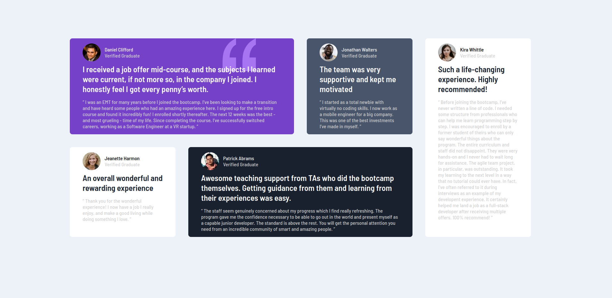

# Frontend Mentor - Testimonials grid section solution

This is a solution to the [Testimonials grid section challenge on Frontend Mentor](https://www.frontendmentor.io/challenges/testimonials-grid-section-Nnw6J7Un7). Frontend Mentor challenges help you improve your coding skills by building realistic projects. 

## Table of contents

- [Frontend Mentor - Testimonials grid section solution](#frontend-mentor---testimonials-grid-section-solution)
  - [Table of contents](#table-of-contents)
  - [Overview](#overview)
    - [The challenge](#the-challenge)
    - [Screenshot](#screenshot)
    - [Links](#links)
  - [My process](#my-process)
    - [Built with](#built-with)
    - [What I learned](#what-i-learned)
    - [Continued development](#continued-development)
    - [Useful resources](#useful-resources)
  - [Author](#author)

## Overview

### The challenge

Users should be able to:

- View the optimal layout for the site depending on their device's screen size

### Screenshot

### Links

- Solution URL: [Testimonials](https://github.com/testimonials)
- Live Site URL: [Testimonials](https://thuri10.github.io/testimonials)

## My process

### Built with

- Semantic HTML5 markup
- CSS custom properties
- Flexbox
- CSS Grid

### What I learned

- Using Grid columns and grid rows for setting up complex layouts.
- Grid responsiveness using media queries and resetting grid-template-layouts.
### Continued development
- Replace the grid with auto-flows for better responsiveness
- 

### Useful resources

- [cssreference.io](https://cssreference.io) -  Reference for CSS layouts and properties

## Author

- Website - [thuri10.github.io](https://thuri10.github.io)
